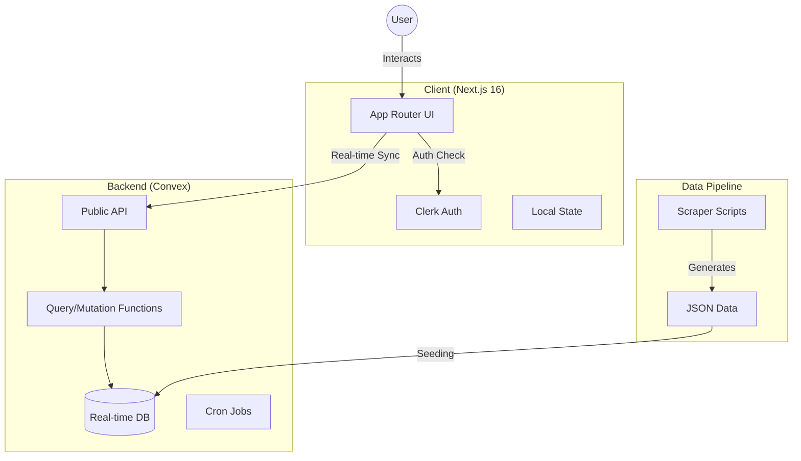

# Aceon 🎓

> The ultimate academic companion for IITM BS Degree students.

Aceon is a modern, high-performance learning platform designed to streamline the study experience for IIT Madras BS Degree students. It replaces scattered resources with a unified Chainsaw Man-themed interface (Blood Red #E62E2D + Acid Green #2BFF00) for lectures, progress tracking, bookmarks, and notes.


## 🚀 Tech Stack

- **Frontend**: [Next.js 16](https://nextjs.org/) (App Router), [React 19](https://react.dev/)
- **Backend**: [Convex](https://convex.dev/) (Real-time Database & Functions)
- **Auth**: [Clerk](https://clerk.com/)
- **Styling**: [Tailwind CSS 4](https://tailwindcss.com/) + [Shadcn UI](https://ui.shadcn.com/)
- **Animation**: [Framer Motion](https://www.framer.com/motion/)
- **Testing**: [Playwright](https://playwright.dev/)
- **Package Manager**: [Bun](https://bun.sh/)

## 🏗️ Architecture

### High-Level Overview



### Data Flow

1.  **Ingestion**: Course data is scraped and stored in `data/*.json`.
2.  **Seeding**: `scripts/seed-database.ts` pushes JSON data to Convex.
3.  **Consumption**: Next.js client subscribes to Convex queries (`useQuery`).
4.  **Interaction**: User actions (bookmarks, notes) trigger Convex mutations (`useMutation`).

## 📂 Project Structure

```bash
aceon/
├── app/                  # Next.js App Router
│   ├── lectures/         # Lecture viewer & course listing
│   └── page.tsx          # Landing page
├── components/
│   ├── ui/               # Shadcn primitives
│   └── shared/           # App-specific components (CourseCard, VideoPlayer)
├── convex/               # Backend logic
│   ├── schema.ts         # Database schema definition
│   ├── courses.ts        # Course queries
│   └── users.ts          # User management
├── data/                 # Raw scraped data (JSON)
├── scripts/              # Data seeding & maintenance scripts
└── public/               # Static assets
```

## ⚡ Getting Started

### Prerequisites
- Node.js 18+ or Bun 1.0+
- Convex Account
- Clerk Account

### Installation

1.  **Clone the repository**
    ```bash
    git clone https://github.com/yourusername/aceon.git
    cd aceon
    ```

2.  **Install dependencies**
    ```bash
    bun install
    ```

3.  **Environment Setup**
    Create a `.env.local` file:
    ```bash
    # Convex
    CONVEX_DEPLOYMENT=your_deployment_name
    NEXT_PUBLIC_CONVEX_URL=your_convex_url

    # Clerk
    NEXT_PUBLIC_CLERK_PUBLISHABLE_KEY=your_clerk_key
    CLERK_SECRET_KEY=your_clerk_secret
    ```

4.  **Run Development Server**
    ```bash
    bun run dev
    ```
    Opens `http://localhost:3000` (Frontend) and Convex Dashboard.

## 🛠️ Key Commands

| Command | Description |
| :--- | :--- |
| `bun run dev` | Start dev server (Next.js + Convex) |
| `bun run build` | Build for production |
| `bun x convex dev` | Run standalone Convex dev server |
| `bun x playwright test` | Run E2E tests |
| `bun run lint` | Run ESLint |

## 🤝 Contributing

1.  Create a feature branch (`feat/amazing-feature`).
2.  Commit your changes (Conventional Commits).
3.  Open a Pull Request.

## 📄 License

MIT © Aceon Team
