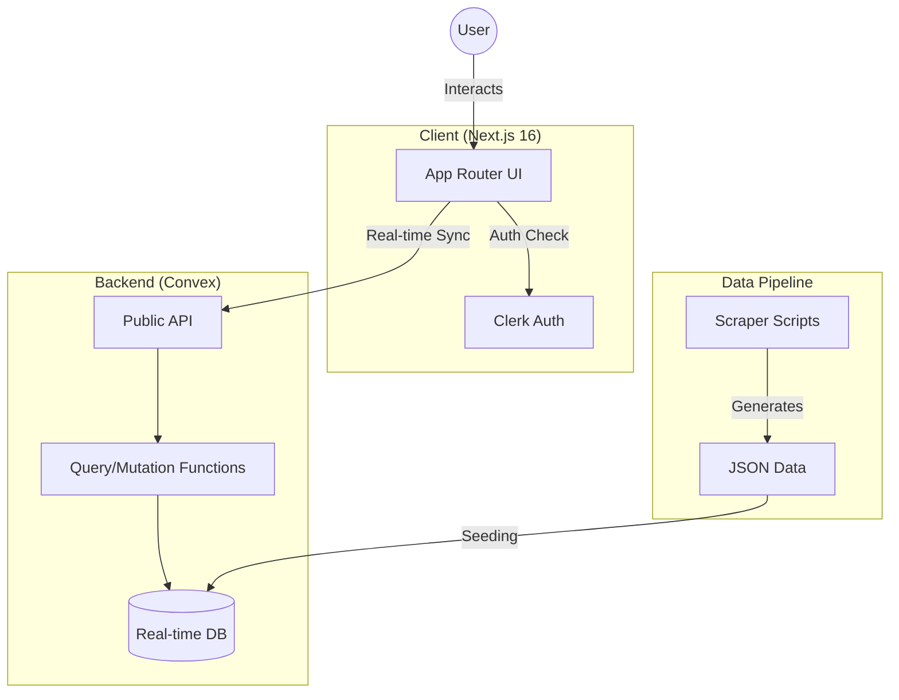

# Aceon 🎓

> The ultimate academic companion for IITM BS Degree students.


## What This Does

Aceon is a modern learning platform designed to streamline the study experience for IIT Madras BS Degree students. It unifies scattered academic resources into a single, cohesive interface.

The application features a unique Chainsaw Man-themed design system (Blood Red & Acid Green) and provides:
- Unified lecture viewing
- Real-time progress tracking
- Course management
- Notes and bookmarks

## Tech Stack

Built with a focus on performance and real-time capabilities:

- **Frontend**: [Next.js 16](https://nextjs.org/) (App Router) & [React 19](https://react.dev/)
- **Backend**: [Convex](https://convex.dev/) - Chosen for its real-time database capabilities and seamless TypeScript integration.
- **Auth**: [Clerk](https://clerk.com/) - Secure, drop-in authentication.
- **Styling**: [Tailwind CSS 4](https://tailwindcss.com/) + [Shadcn UI](https://ui.shadcn.com/)
- **Testing**: [Playwright](https://playwright.dev/) for E2E reliability.
- **Runtime**: [Bun](https://bun.sh/) for fast package management and script execution.

## Getting Started

### Prerequisites

- Node.js 18+ or Bun 1.0+
- Convex Account
- Clerk Account

### Installation

1.  **Clone the repository**
    ```bash
    git clone https://github.com/yourusername/aceon.git
    cd aceon
    ```

2.  **Install dependencies**
    ```bash
    bun install
    ```

3.  **Environment Setup**
    Create a `.env.local` file:
    ```bash
    # Convex
    CONVEX_DEPLOYMENT=your_deployment_name
    NEXT_PUBLIC_CONVEX_URL=your_convex_url

    # Clerk
    NEXT_PUBLIC_CLERK_PUBLISHABLE_KEY=your_clerk_key
    CLERK_SECRET_KEY=your_clerk_secret
    ```

4.  **Run Development Server**
    ```bash
    bun run dev
    ```
    Opens `http://localhost:3000`.

## How It Works

### Architecture

The app follows a modern serverless architecture using Convex for backend logic and data storage.



### Data Pipeline

1.  **Ingestion**: Course data is scraped and stored in `data/*.json`.
2.  **Seeding**: `scripts/seed-database.ts` pushes JSON data to Convex.
3.  **Consumption**: Next.js client subscribes to Convex queries (`useQuery`) for reactive UI updates.

## What I Learned

- **Real-time State Management**: Leveraging Convex to eliminate manual client-side state management for live data.
- **Modern React Patterns**: Utilizing React 19 features and Next.js App Router for optimal performance.
- **Design System Implementation**: Building a custom, thematic UI library on top of Tailwind and Shadcn.

## License

MIT © Aceon Team
