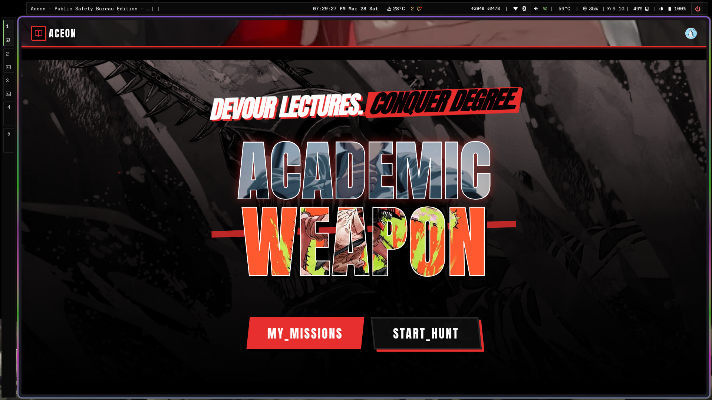

# Aceon

Academic companion for IITM BS Degree students, built as a focused lecture dashboard with course navigation, YouTube playback, progress tracking, and profile-aware course organization.

Aceon uses a Chainsaw Man inspired visual system: black surfaces, blood red primary actions, acid green accents, hard edges, clipped corners, halftone texture, and dense mission-control style UI.



## Features

- Protected lecture dashboard for enrolled courses and the full course library
- Course -> week -> video navigation
- Custom YouTube IFrame API player controls
- Smart video resume from saved position
- Progress persistence during playback, pause, and page close
- Completion toggles for videos, weeks, and courses
- Timestamped video notes backend support
- Clerk-authenticated Convex data access
- Responsive mobile dashboard, course archive, and lecture player layouts
- Mobile sheet navigation for the lecture sidebar
- Touch-friendly custom player controls with fullscreen landscape support where the browser allows it

## Stack

| Area | Tooling |
| --- | --- |
| App | Next.js 16 App Router, React 19 |
| Backend | Convex |
| Auth | Clerk |
| Styling | Tailwind 4, shadcn UI, Radix |
| Video | YouTube IFrame API |
| Runtime | Bun |

## Project Map

```text
app/                         Next.js routes and API route
components/                  UI, lecture, shared, profile, landing components
convex/                      Schema, queries, mutations, migrations
hooks/                       Video progress, navigation, autoplay, shortcuts
docs/ARCHITECTURE.md         Current architecture documentation
docs/DESIGN.yaml             Current design source of truth
scripts/                     Scraping, seeding, diagnostics, maintenance
public/images/               Brand, texture, and page imagery
```

## Mobile Testing

The mobile experience is designed around `320px` through `767px` wide screens, with tablet checks from `768px` through `1023px`. The key mobile surfaces are:

- `/` landing hero, including stacked headline and lower CTA placement
- `/lectures` enrolled missions and mission archives
- `/lectures/[subjectId]` player, course sheet, touch seek, volume, fullscreen, and orientation behavior
- `/privacy` and `/terms` long-title wrapping and footer layout

When testing on an Android phone against the local dev server, forward the app port with:

```bash
adb reverse tcp:5550 tcp:5550
```

Then open `http://localhost:5550` on the phone.

## Getting Started

Install dependencies:

```bash
bun install
```

Create `.env.local`:

```bash
CONVEX_DEPLOYMENT=prod:glad-marten-760
NEXT_PUBLIC_CONVEX_URL=your_convex_url
NEXT_PUBLIC_CLERK_PUBLISHABLE_KEY=your_clerk_publishable_key
CLERK_SECRET_KEY=your_clerk_secret_key
```

Start the dev server:

```bash
bun run dev
```

The app runs on `http://localhost:5550`.

Important: local development currently uses the production Convex deployment, `prod:glad-marten-760`. Do not switch to the empty dev deployment unless the data migration plan explicitly calls for it.

## Common Commands

| Task | Command |
| --- | --- |
| Dev server | `bun run dev` |
| Lint | `bun run lint` |
| Type check | `bun x tsc --noEmit` |
| Production build | `bun run build` |
| Convex dev | `bun x convex dev` |

Before starting a dev server, check whether one is already running on port `5550`.

## Architecture

Aceon is a client-heavy Next.js app backed by Convex real-time queries and Clerk auth. The main learning flow is:

```text
/lectures/[subjectId]
  -> load course and content from Convex
  -> select URL video or first incomplete video
  -> initialize YouTube IFrame player
  -> save progress through Convex mutations and beacon fallback
```

See [docs/ARCHITECTURE.md](docs/ARCHITECTURE.md) for the full system map, data model, route surface, provider flow, and review targets.

## Design

The maintained design spec is [docs/DESIGN.yaml](docs/DESIGN.yaml). It documents the current palette, typography, component roles, image overlay rules, responsive targets, and implementation constraints.

The short version:

- Primary: `#E62E2D`
- Accent: `#2BFF00`
- Background: `#000000`
- Shape: square or clipped corners
- Texture: halftone/noise overlays
- UI voice: academic mission control
- Brand assets: cropped Aceon logo in navigation, footer, favicon, and app icon

## Data And Scraping Notes

Scraping and data maintenance docs live in `docs/`:

- [docs/scrape.md](docs/scrape.md)
- [docs/SCRAPER_UPDATE.md](docs/SCRAPER_UPDATE.md)
- [docs/SCRAPING_LOG.md](docs/SCRAPING_LOG.md)
- [docs/DATA_INTEGRITY_REPORT.md](docs/DATA_INTEGRITY_REPORT.md)
- [docs/CONVEX_MIGRATIONS.md](docs/CONVEX_MIGRATIONS.md)

Treat scraped data, backups, token files, and `.env.local` as private local material. Do not commit secrets.

## Validation

Run the narrow baseline before committing code changes:

```bash
bun run lint
bun x tsc --noEmit
```

Use `bun run build` for release or performance-sensitive changes.

## Version

Current version: `0.9.0`.

Version bumps are automated by the GitHub workflow after conventional commits land on `main`.
